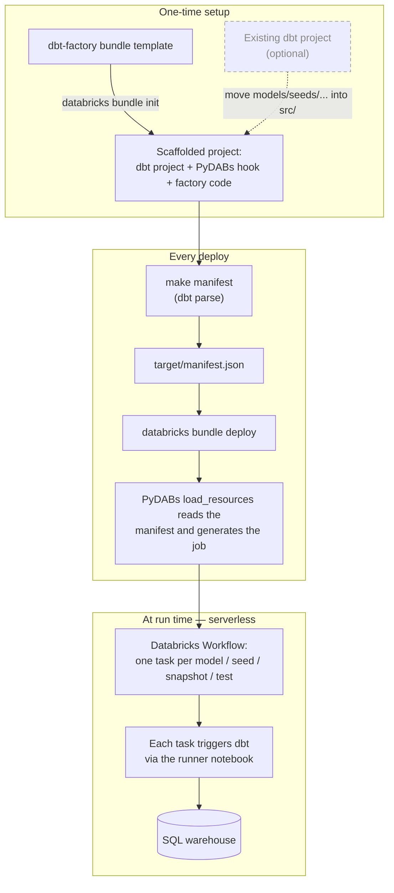

# dbt_factory

This example runs a [dbt](https://docs.getdbt.com/) project on Databricks as a
**Databricks Workflow with one task per dbt object** (model, seed, snapshot, test) instead of
running the whole project as a single opaque task.

It does this by combining two pieces:

* **[databricks-dbt-factory](https://github.com/mwojtyczka/databricks-dbt-factory)** — a small
  library that reads a dbt `manifest.json` and expands it into Databricks job tasks, wiring up
  the dependencies between them. Its source is included under `src/databricks_dbt_factory/`
  (see [`NOTICE`](NOTICE) for attribution and license).
* **[PyDABs](https://docs.databricks.com/dev-tools/bundles/python)** — the Databricks Asset
  Bundle Python resources hook. At `databricks bundle deploy` time the Databricks CLI calls
  `load_resources` in [`resources/__init__.py`](resources/__init__.py), which runs the factory
  against the manifest and returns the generated job.

The result: **no per-model job YAML is checked in**. The task graph is generated on the fly from
the dbt manifest each time you deploy.

## Why one task per dbt object?

By default dbt's integration with Databricks Workflows treats the whole project as a single
task — a black box. Expanding it into one task per object gives:

* **Faster execution** — independent models run in parallel, and the notebook task type keeps
  dbt's dependencies pre-cached in the serverless environment, avoiding a cold start on every task.
* **Visibility & simplified troubleshooting** — pinpoint and fix issues at the model level right
  in the Databricks Workflows UI.
* **Enhanced logging & notifications** — per-task logs and precise, model-level error alerts.
* **Improved retriability** — retry only the failed model tasks without rerunning the whole project.
* **Seamless testing** — dbt data tests run as their own tasks right after each model finishes,
  for faster validation and feedback.

This example uses **serverless compute** and the **notebook task type** (each task triggers dbt
through a small runner notebook using the `dbtRunner` Python API) for the fastest task start
times. See the [databricks-dbt-factory README](https://github.com/mwojtyczka/databricks-dbt-factory#benefits)
for more.

## How it works

The [`dbt-factory` template](../templates/dbt-factory) scaffolds a self-contained project.
From then on, each `databricks bundle deploy` regenerates the Workflow from your current dbt
manifest — add or remove a model and the task graph follows on the next deploy, with no per-model
YAML to maintain.



## Project structure

```
dbt_factory/
├── databricks.yml              # Bundle definition; wires up the PyDABs `load_resources` hook
├── dbt_project.yml             # dbt project (models under src/models, etc.)
├── dbt_profiles/profiles.yml   # dbt profiles for the deployed job (dev / prod targets)
├── profile_template.yml        # prompts for `dbt init` (local development)
├── resources/__init__.py       # PyDABs glue: manifest -> generated job (the only integration code)
├── src/
│   ├── models/                 # your dbt models (example: orders_raw, orders_daily)
│   └── databricks_dbt_factory/ # vendored factory library (unchanged; see NOTICE)
├── target/manifest.json        # committed dbt manifest, read at deploy time (regenerate with `make manifest`)
├── tests/                      # tests for the vendored factory + the PyDABs integration
├── pyproject.toml              # dependencies (installed into .venv via `uv sync`)
└── Makefile                    # convenience targets: setup, manifest, validate, deploy, run, test
```

## Setup

1. Install the [Databricks CLI](https://docs.databricks.com/dev-tools/cli/databricks-cli.html)
   and the [uv](https://docs.astral.sh/uv/) package manager.

2. Authenticate to your Databricks workspace:
   ```
   $ databricks configure
   ```

3. Install dependencies into the `.venv` the bundle uses:
   ```
   $ make setup      # == uv sync --dev
   ```

4. Edit `dbt_profiles/profiles.yml` and set your SQL warehouse `http_path`, `catalog`, and
   `schema`. Set the workspace host in `databricks.yml` (and the prod `root_path` / permissions).

## The dbt manifest

`resources/__init__.py` reads `target/manifest.json` at deploy time to build the task graph. A
manifest is committed so the bundle deploys out of the box. **After you change your models,
regenerate it:**

```
$ make manifest      # == uv run dbt deps && uv run dbt parse
```

`dbt parse` only reads your project files; it does not connect to a warehouse. The manifest
location is configurable — point at a different file via the `DBT_MANIFEST_PATH` environment
variable or by editing `MANIFEST_PATH` in `resources/__init__.py`.

> **Large projects with many parallel tasks.** At runtime each task runs dbt from the shared
> project directory and writes dbt's artifacts (`target/`, `logs/`) there, which can contend
> under high parallelism. To avoid this, generate a `target/partial_parse.msgpack` (a local
> `dbt parse` produces it next to the manifest) and ship it with the bundle — it's `.gitignore`d
> by default, so force-add it (`git add -f target/partial_parse.msgpack`). The runner notebook
> then routes each task's artifacts to a private temp dir and skips re-parsing. See the
> databricks-dbt-factory README, "Faster parsing on large projects".

## Deploy and run

```
$ databricks bundle deploy --target dev      # or: make deploy
$ databricks bundle run dbt_factory_job       # or: make run
```

Open the run URL the CLI prints to watch the generated per-model task graph execute. Deploying
in `dev` mode prefixes resources with `[dev your_name]` and pauses the daily schedule; deploy to
`prod` with `--target prod`.

## Configuring the generated job

A few knobs are exposed as constants at the top of `resources/__init__.py`:

* `BUNDLE_TESTS` — when `True`, single-model tests are bundled into one `dbt test` task per
  resource (fewer task startups; faster for test-heavy projects). Default `False` (one task per
  test node, for maximum per-test visibility).
* `ENVIRONMENT_KEY` — the serverless environment key (default `Default`).
* `EXTRA_DBT_COMMAND_OPTIONS` — extra options appended to every generated dbt command.

The dbt target, warehouse, catalog, and schema are configured in `dbt_profiles/profiles.yml`
and selected per bundle target via `--target ${bundle.target}`.

## Migrating an existing dbt project

Bring your own dbt project by **generating a fresh project from the template and moving your dbt
files into it.** You don't touch dependencies, the vendored factory, or any paths — the generated
project already ships all of that.

1. Generate a new project (or copy this `dbt_factory` example):

   ```
   $ databricks bundle init https://github.com/databricks/bundle-examples --template-dir contrib/templates/dbt-factory
   ```

2. Remove the starter models and copy your dbt sources into the matching `src/` subdirectories:

   ```
   $ rm -r src/models/example
   # Copy whichever of these your project has (skip the ones you don't use):
   $ cp -R /path/to/your/dbt/models/*     src/models/
   $ cp -R /path/to/your/dbt/seeds/*      src/seeds/
   $ cp -R /path/to/your/dbt/snapshots/*  src/snapshots/
   $ cp -R /path/to/your/dbt/macros/*     src/macros/
   $ cp -R /path/to/your/dbt/tests/*      src/tests/
   ```

   The generated `dbt_project.yml` already points `model-paths`, `seed-paths`, etc. at these
   `src/` folders, so your files are picked up as-is. Merge any model/seed configuration from your
   own `dbt_project.yml` into the generated one (keep the generated `name`/`profile`), and remove
   the leftover `models: dbt_factory: example:` block that referenced the deleted starter models —
   otherwise `dbt parse` warns that those config paths don't apply to any resource. If you use dbt
   packages, copy your `packages.yml` to the project root too.

3. Point `dbt_profiles/profiles.yml` at your warehouse (`http_path`, `catalog`, `schema`). Leave
   the `host`/`token` lines as they are — the runner notebook sets those at runtime.

4. Generate the manifest and deploy:

   ```
   $ make setup
   $ make manifest      # dbt parse -> target/manifest.json
   $ databricks bundle deploy --target dev
   ```

That's the whole migration: no dependency wrangling and no path edits, because your project keeps
the generated layout (dbt project at the bundle root, factory under `src/`). If you'd rather keep
your project's existing directory structure instead of `src/`, edit the `*-paths` in
`dbt_project.yml` to point at your folders — nothing else changes.

## Tests

```
$ make test      # == uv run pytest tests
```

This runs the vendored factory's own test suite (proving the vendored core is intact) plus an
offline test that exercises the PyDABs integration against the committed manifest — no workspace
required.

## Local development with dbt

You can still develop the dbt project locally with the dbt CLI. Initialize your own profile with
`dbt init` (see `profile_template.yml`), then use `dbt run`, `dbt test`, etc. as usual. See the
[`dbt_sql`](../../dbt_sql) example for a more detailed local-dbt walkthrough.
