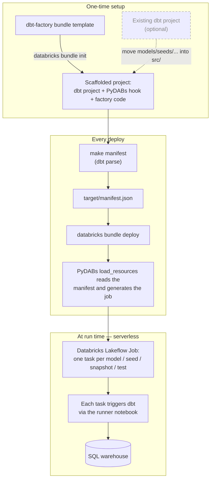

# dbt_factory

This example runs a [dbt](https://docs.getdbt.com/) project on Databricks as a
**Databricks Lakeflow Job with one task per dbt object** (model, seed, snapshot, test) instead of
running the whole project as a single opaque task.

It does this by combining two pieces:

* **[databricks-dbt-factory](https://github.com/mwojtyczka/databricks-dbt-factory)** — a small
  library that reads a dbt `manifest.json` and expands it into Databricks job tasks, wiring up
  the dependencies between them. Its source is included under `src/databricks_dbt_factory/`
  (see [`NOTICE`](NOTICE) for attribution and license).
* **[PyDABs](https://docs.databricks.com/dev-tools/bundles/python)** — the Declarative Automation
  Bundles Python resources hook. At `databricks bundle deploy` time the Databricks CLI calls
  `load_resources` in [`resources/__init__.py`](resources/__init__.py), which runs the factory
  against the manifest and returns the generated job.

The result: **no per-model job YAML is checked in**. The task graph is generated on the fly from
the dbt manifest each time you deploy.

## Why one task per dbt object?

By default dbt's integration with Databricks Lakeflow Jobs treats the whole project as a single
task — a black box. Expanding it into one task per object gives:

* **Faster execution** — independent models run in parallel, and the notebook task type runs dbt
  from a pre-built serverless base environment, avoiding a dependency install on every task.
* **Visibility & simplified troubleshooting** — pinpoint and fix issues at the model level right
  in the Databricks Lakeflow Jobs UI.
* **Enhanced logging & notifications** — per-task logs and precise, model-level error alerts.
* **Improved retriability** — retry only the failed model tasks without rerunning the whole project.
* **Seamless testing** — dbt data tests run as their own tasks right after each model finishes,
  for faster validation and feedback.

This example uses **serverless compute** and the **notebook task type** (each task triggers dbt
through a small runner notebook using the `dbtRunner` Python API) for the fastest task start
times. See the [databricks-dbt-factory README](https://github.com/mwojtyczka/databricks-dbt-factory#benefits)
for more.

## How it works

The [`dbt-factory` template](../templates/dbt-factory) scaffolds a self-contained project.
From then on, each `databricks bundle deploy` regenerates the job from your current dbt
manifest — add or remove a model and the task graph follows on the next deploy, with no per-model
YAML to maintain.



## Project structure

```
dbt_factory/
├── databricks.yml              # Bundle definition; wires up the PyDABs `load_resources` hook
├── dbt_project.yml             # dbt project (models under src/models, etc.)
├── dbt_profiles/profiles.yml   # dbt profiles for the deployed job (dev / prod targets)
├── profile_template.yml        # prompts for `dbt init` (local development)
├── resources/__init__.py       # PyDABs glue: manifest -> generated job (the only integration code)
├── src/
│   ├── models/                 # your dbt models (example: orders_raw, orders_daily)
│   └── databricks_dbt_factory/ # vendored factory library (trimmed; see NOTICE)
├── target/manifest.json        # committed dbt manifest, read at deploy time (regenerate with `make manifest`)
├── tests/                      # tests for the vendored factory + the PyDABs integration
├── pyproject.toml              # dependencies (installed into .venv via `uv sync`)
└── Makefile                    # convenience targets: setup, manifest, validate, deploy, run, test, test-e2e
```

## Setup

1. Install the [Databricks CLI](https://docs.databricks.com/dev-tools/cli/databricks-cli.html)
   and the [uv](https://docs.astral.sh/uv/) package manager.

2. Authenticate to your Databricks workspace:
   ```
   $ databricks configure
   ```

3. Install dependencies into the `.venv` the bundle uses:
   ```
   $ make setup      # == uv sync --dev
   ```

4. Edit `dbt_profiles/profiles.yml` and set your SQL warehouse `http_path`, `catalog`, and
   `schema`. Set the workspace host in `databricks.yml` (and the prod `root_path` / permissions).

## The dbt manifest

`resources/__init__.py` reads `target/manifest.json` at deploy time to build the task graph. A
manifest is committed so the bundle deploys out of the box. **After you change your models,
regenerate it:**

```
$ make manifest      # == uv run dbt deps && uv run dbt parse
```

`dbt parse` only reads your project files; it does not connect to a warehouse. The manifest
location is configurable — point at a different file via the `DBT_MANIFEST_PATH` environment
variable or by editing `MANIFEST_PATH` in `resources/__init__.py`.

> **Faster task startup (automatic).** `make manifest` also writes `target/partial_parse.msgpack`
> next to the manifest. The bundle syncs it (`sync.include` in `databricks.yml`) and each notebook
> task injects it to **skip dbt's parse phase** — a large win on big projects, where parsing (not
> the SQL) dominates each task's time. No `git add -f` needed: because the runtime dbt is pinned to
> your local version (see "dbt version and the serverless environment" below), the version-specific
> msgpack always loads instead of being silently ignored. Deploy with `make deploy` (or run
> `make manifest` first) so the shipped msgpack always matches your current models.

## Deploy and run

```
$ make deploy      # regenerates the manifest + parse cache, then deploys
$ make run         # == databricks bundle run dbt_factory_job
```

`make deploy` regenerates `target/manifest.json` and `target/partial_parse.msgpack` (via `dbt
parse`) before deploying, so the task graph and the synced parse cache always match your current
models. You can also call the CLI directly — just run `make manifest` first:

```
$ databricks bundle deploy --target dev
$ databricks bundle run dbt_factory_job
```

Open the run URL the CLI prints to watch the generated per-model task graph execute. Deploying
in `dev` mode prefixes resources with `[dev your_name]` and pauses the daily schedule; deploy to
`prod` with `--target prod`.

## Configuring the generated job

A few knobs are exposed as constants at the top of `resources/__init__.py`:

* `BUNDLE_TESTS` — when `True`, single-model tests are bundled into one `dbt test` task per
  resource (fewer task startups; faster for test-heavy projects). Default `False` (one task per
  test node, for maximum per-test visibility).
* `ENVIRONMENT_KEY` — the serverless environment key (default `Default`).
* `EXTRA_DBT_COMMAND_OPTIONS` — extra options appended to every generated dbt command.

The dbt target, warehouse, catalog, and schema are configured in `dbt_profiles/profiles.yml`
and selected per bundle target via `--target ${bundle.target}`.

### dbt version and the serverless environment

You don't set the runtime dbt version by hand. At deploy time `resources/__init__.py` pins the
serverless environment to the **exact `dbt-databricks` version installed in the bundle's `.venv`** —
the same version you use locally to generate the manifest and develop with. `pyproject.toml` is the
single source of truth: change the version there, re-run `make setup`, and the next deploy uses it.
This guarantees the version running in Databricks matches the one you tested with.

The version is shipped as a small `dbt_serverless_env.yaml` [base environment](https://docs.databricks.com/aws/en/compute/serverless/dependencies)
that the bundle generates and syncs on every deploy (git-ignored), so Databricks pre-builds the
environment once instead of installing dbt on every task.

## Tests

```
$ make test      # == uv run pytest tests
```

This runs the factory's unit tests plus an offline test that exercises the PyDABs integration
against the committed manifest; no workspace is required. One test compares the generated tasks
with a saved snapshot (`tests/test_data/expected_tasks.json`), so unintended changes to the
generated job fail the suite. After an intentional change to the generated output, refresh the
snapshot with `make test-update-expected-tasks`.

There is also a live end-to-end test that generates a project from the template, deploys it to
your workspace, runs the generated job, verifies the output tables, and tears everything down
again:

```
$ make test-e2e
```

See [`tests/e2e/README.md`](tests/e2e/README.md) for the required environment variables.

## Local development with dbt

You can still develop the dbt project locally with the dbt CLI. Initialize your own profile with
`dbt init` (see `profile_template.yml`), then use `dbt run`, `dbt test`, etc. as usual. See the
[`dbt_sql`](../../dbt_sql) example for a more detailed local-dbt walkthrough.
