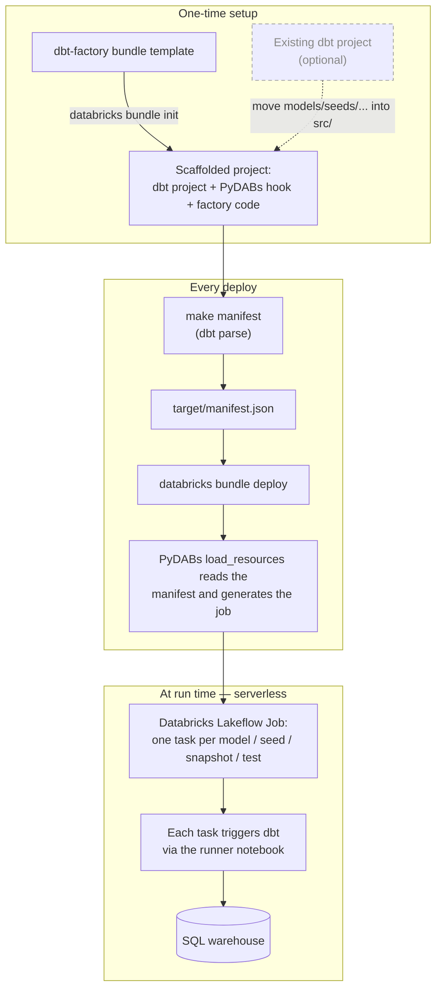

# dbt-factory template

A [Declarative Automation Bundles](https://docs.databricks.com/dev-tools/bundles/index.html) template
that generates a [dbt](https://docs.getdbt.com/) project whose Databricks Lakeflow Job is built
**from the dbt manifest at deploy time** — one Databricks task per dbt object (model, seed,
snapshot, test), running on serverless compute by default (or on a job cluster).

It wires together two pieces:

* **[databricks-dbt-factory](https://github.com/mwojtyczka/databricks-dbt-factory)** — expands a
  dbt `manifest.json` into Databricks job tasks with their dependencies. Its source is included
  in every generated project under `src/databricks_dbt_factory/`.
* **[PyDABs](https://docs.databricks.com/dev-tools/bundles/python)** — the `python.resources`
  hook. At `databricks bundle deploy` time the Databricks CLI calls `load_resources`, which runs
  the factory against the manifest and returns the generated job. No per-model job YAML is checked
  in.

Instead of running the whole dbt project as one opaque task, you get:

* **Faster execution** — independent models run in parallel; the notebook task type keeps dbt's
  dependencies pre-cached in the serverless environment, avoiding a per-task cold start.
* **Visibility & simplified troubleshooting** — pinpoint failures at the model level in the UI.
* **Enhanced logging & notifications** — per-task logs and precise, model-level error alerts.
* **Improved retriability** — retry only the failed model tasks, not the whole project.
* **Seamless testing** — dbt data tests run as their own tasks right after each model finishes.

For a pre-initialized, ready-to-read version of what this template produces, see the
[`contrib/dbt_factory`](../../dbt_factory) example.

## How it works

`databricks bundle init` scaffolds a self-contained project; each `databricks bundle deploy` then
regenerates the job from your current dbt manifest, so adding or removing a model just works
on the next deploy — no per-model YAML to maintain.



## Usage

This scaffolds a **new** project preloaded with the template's default example — a couple of starter
models you replace with your own. (Already have a dbt project? See
[Already have a dbt project?](#already-have-a-dbt-project) below.)

```
$ databricks bundle init https://github.com/databricks/bundle-examples --template-dir contrib/templates/dbt-factory
```

Answer the prompts (project name, catalog, dev schema, warehouse HTTP path, and a few
factory options). Then:

```
$ cd <project_name>
$ make setup       # install dependencies into .venv
$ make manifest    # generate the dbt manifest (dbt parse) — required before the first deploy
$ databricks bundle deploy --target dev
$ databricks bundle run <project_name>_job
```

## Prompts

| Prompt | Purpose |
|---|---|
| `project_name` | Bundle / dbt project name; also names the generated job `<project_name>_job`. |
| `default_catalog` | Unity Catalog catalog dbt writes to. |
| `dev_schema` | Schema for the `dev` target (`prod` uses `default`). |
| `http_path` | HTTP path of the SQL warehouse dbt connects to. |
| `bundle_tests` | Bundle single-model tests per resource into one task (performance boost). |
| `use_serverless` | Run the job on serverless compute (default). Choose `no` to run on a job cluster (classic compute) defined in `resources/__init__.py`, which you can size to your workload. |
| `environment_key` | Key of the serverless environment used by the generated job (serverless only). |
| `extra_dbt_command_options` | Extra options appended to every generated dbt command. |

### Compute

The generated job supports two compute types, chosen by the `use_serverless` prompt:

- **Serverless (default)** — no cluster to manage.
- **Job cluster (classic)** — a single job cluster, created once per run and **shared by all
  tasks**, then torn down when the run finishes. It only orchestrates (queries run on your SQL
  warehouse), so it defaults to a **single node** (extra workers don't speed dbt up). You can size
  it by editing the `job_clusters` block in the generated `resources/__init__.py` before deploying
  (see the generated project's README, "Sizing the job cluster").

Running on an existing (all-purpose) cluster is **not supported**.

## Already have a dbt project?

Bring your own dbt project by generating a fresh project (as in [Usage](#usage) above) and moving
your dbt files into it. You don't touch dependencies, the vendored factory, or any paths — the
generated project already ships all of that.

1. Remove the starter models and copy your dbt sources into the matching `src/` subdirectories:

   ```
   $ rm -r src/models/example
   # Copy whichever of these your project has (skip the ones you don't use):
   $ cp -R /path/to/your/dbt/models/*     src/models/
   $ cp -R /path/to/your/dbt/seeds/*      src/seeds/
   $ cp -R /path/to/your/dbt/snapshots/*  src/snapshots/
   $ cp -R /path/to/your/dbt/macros/*     src/macros/
   $ cp -R /path/to/your/dbt/tests/*      src/tests/
   ```

   The generated `dbt_project.yml` already points `model-paths`, `seed-paths`, etc. at these `src/`
   folders, so your files are picked up as-is. Merge any model/seed configuration from your own
   `dbt_project.yml` into the generated one (keep the generated `name`/`profile`), and remove the
   leftover `models:` block that referenced the deleted starter models — otherwise `dbt parse` warns
   that those config paths don't apply to any resource. If you use dbt packages, copy your
   `packages.yml` to the project root too: `make manifest` installs them (`dbt deps`) and the bundle
   syncs the resulting `dbt_packages/` to the workspace, so the job never installs packages at
   runtime.

2. Point `dbt_profiles/profiles.yml` at your warehouse (`http_path`, `catalog`, `schema`). Leave the
   `host`/`token` lines as they are — the runner notebook sets those at runtime.

3. Generate the manifest, deploy, and run:

   ```
   $ make setup
   $ make manifest      # dbt parse -> target/manifest.json
   $ databricks bundle deploy --target dev
   $ databricks bundle run <project_name>_job
   ```

That's the whole migration: no dependency wrangling and no path edits, because your project keeps the
generated layout (dbt project at the bundle root, factory under `src/`). To keep your existing
directory structure instead of `src/`, edit the `*-paths` in `dbt_project.yml` to point at your
folders — nothing else changes.

## Do developers switch to Jobs, or stay in dbt?

Developers continue working natively in dbt — the factory operates on the deployment side. Lakeflow
Jobs still runs the dbt project directly; instead of executing it as an opaque black box, the
factory decomposes the run into discrete, observable task nodes with per-model retries and logs.

## Are dbt Jinja and templating converted to dynamic parameters?

No — there are no dynamic Databricks parameters. The manifest is pre-compiled (`make manifest`), so
dbt Jinja (`ref()`, `source()`, `var()`) is resolved before deploy into static commands
(`dbt run --select my_model`). To vary behavior, use dbt's own mechanisms:

- **`vars:` in `dbt_project.yml`** — baked into the manifest ahead of time, for deterministic runs.
- **`profiles.yml` targets** — selected per deploy target (dev/prod) for per-environment differences.
- **`env_var()`** — for runtime values that do not alter the graph topology.

See https://github.com/databricks/bundle-examples/blob/main/contrib/README.md for more about
community contributions.
