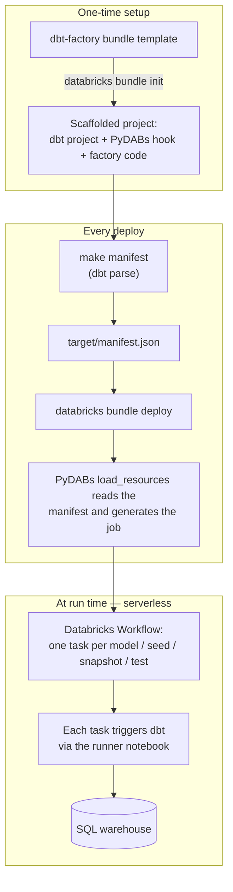

# dbt-factory template

A [Databricks Asset Bundle](https://docs.databricks.com/dev-tools/bundles/index.html) template
that generates a [dbt](https://docs.getdbt.com/) project whose Databricks Workflow is built
**from the dbt manifest at deploy time** — one Databricks task per dbt object (model, seed,
snapshot, test), running on serverless compute.

It wires together two pieces:

* **[databricks-dbt-factory](https://github.com/mwojtyczka/databricks-dbt-factory)** — expands a
  dbt `manifest.json` into Databricks job tasks with their dependencies. Its source is included
  in every generated project under `src/databricks_dbt_factory/`.
* **[PyDABs](https://docs.databricks.com/dev-tools/bundles/python)** — the `python.resources`
  hook. At `databricks bundle deploy` time the Databricks CLI calls `load_resources`, which runs
  the factory against the manifest and returns the generated job. No per-model job YAML is checked
  in.

Instead of running the whole dbt project as one opaque task, you get:

* **Faster execution** — independent models run in parallel; the notebook task type keeps dbt's
  dependencies pre-cached in the serverless environment, avoiding a per-task cold start.
* **Visibility & simplified troubleshooting** — pinpoint failures at the model level in the UI.
* **Enhanced logging & notifications** — per-task logs and precise, model-level error alerts.
* **Improved retriability** — retry only the failed model tasks, not the whole project.
* **Seamless testing** — dbt data tests run as their own tasks right after each model finishes.

For a pre-initialized, ready-to-read version of what this template produces, see the
[`contrib/dbt_factory`](../../dbt_factory) example.

## How it works

`databricks bundle init` scaffolds a self-contained project; each `databricks bundle deploy` then
regenerates the Workflow from your current dbt manifest, so adding or removing a model just works
on the next deploy — no per-model YAML to maintain.



## Usage

```
$ databricks bundle init https://github.com/databricks/bundle-examples --template-dir contrib/templates/dbt-factory
```

Answer the prompts (project name, catalog, dev schema, warehouse HTTP path, and a few
factory options). Then:

```
$ cd <project_name>
$ make setup       # install dependencies into .venv
$ make manifest    # generate the dbt manifest (dbt parse) — required before the first deploy
$ databricks bundle deploy --target dev
$ databricks bundle run <project_name>_job
```

## Prompts

| Prompt | Purpose |
|---|---|
| `project_name` | Bundle / dbt project name; also names the generated job `<project_name>_job`. |
| `default_catalog` | Unity Catalog catalog dbt writes to. |
| `dev_schema` | Schema for the `dev` target (`prod` uses `default`). |
| `http_path` | HTTP path of the SQL warehouse dbt connects to. |
| `bundle_tests` | Bundle single-model tests per resource into one task (performance boost). |
| `environment_key` | Key of the serverless environment used by the generated job. |
| `extra_dbt_command_options` | Extra options appended to every generated dbt command. |

## Already have a dbt project?

This template scaffolds a new project. To reuse an **existing** dbt project, generate a project
from this template and move your dbt files into it — see the
["Migrating an existing dbt project"](../../dbt_factory/README.md#migrating-an-existing-dbt-project)
guide in the example. You won't need to bring any dependencies or edit paths.

See https://github.com/databricks/bundle-examples/blob/main/contrib/README.md for more about
community contributions.
