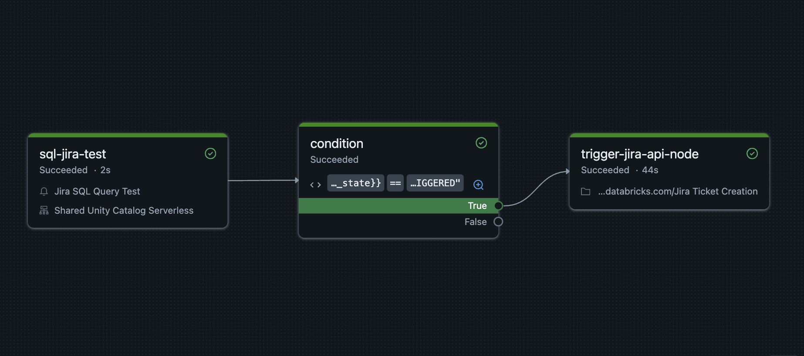

# SQL Alert Trigger

The 'sql-alert-trigger' project contains a databricks job and a Python notebook that connects to your **Jira** environment and creates an issue when run.



### Databricks Asset Bundle Template: Alert-Triggered Job
 
 This template creates a job that:
 1. Runs a SQL alert query
 2. Checks if the alert was triggered
 3. Executes a notebook if the condition is met

Common use case: Monitor data quality, send notifications, or trigger remediation


## Getting started

1. Install the Databricks CLI from https://docs.databricks.com/dev-tools/cli/install.html

2. Authenticate to your Databricks workspace (if you have not done so already):
    ```
    $ databricks configure
    ```

3. Initialize this template in your environment

   ``` 
   databricks bundle init https://github.com/databricks/bundle-examples --template-dir contrib/templates/sql-alert-trigger
   ```
You will be prompted to provide the following details to tailor the template to your preference:
- Project name
- SQL warehouse ID
- SQL alert ID

Ensure you update the Python notebook to include your Jira connection details.


4. To deploy a development copy of this project, type:
    ```
    $ databricks bundle deploy --target dev
    ```
    (Note that "dev" is the default target, so the `--target` parameter
    is optional here.)

    This deploys everything that's defined for this project.
    For example, the default template would deploy a job called
    `[dev yourname] Alert-Workflow` to your workspace.
    You can find that job by opening your workpace and clicking on **Jobs & Pipelines**.

4. Similarly, to deploy a production copy, type:
   ```
   $ databricks bundle deploy --target prod
   ```

5. To run a job, use the "run" command:
   ```
   $ databricks bundle run
   ```

6. Optionally, install developer tools such as the Databricks extension for Visual Studio Code from
   https://docs.databricks.com/dev-tools/vscode-ext.html.

7. For documentation on the Databricks Asset Bundles format used
   for this project, and for CI/CD configuration, see
   https://docs.databricks.com/dev-tools/bundles/index.html.