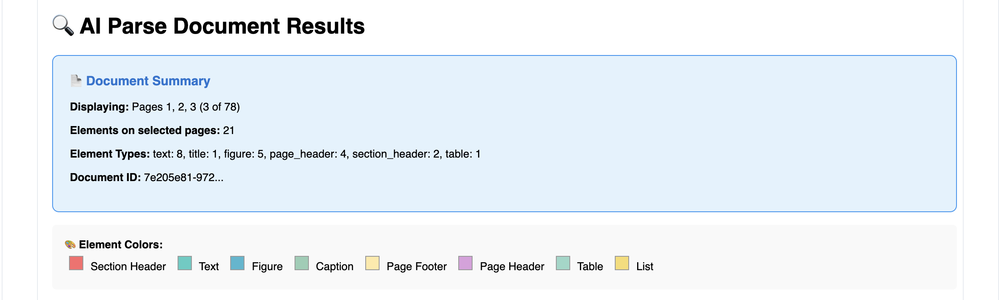
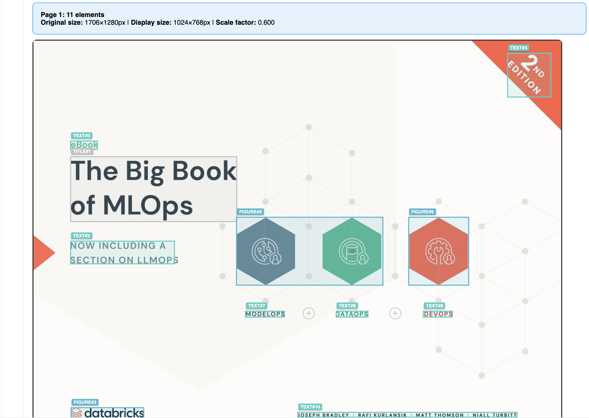
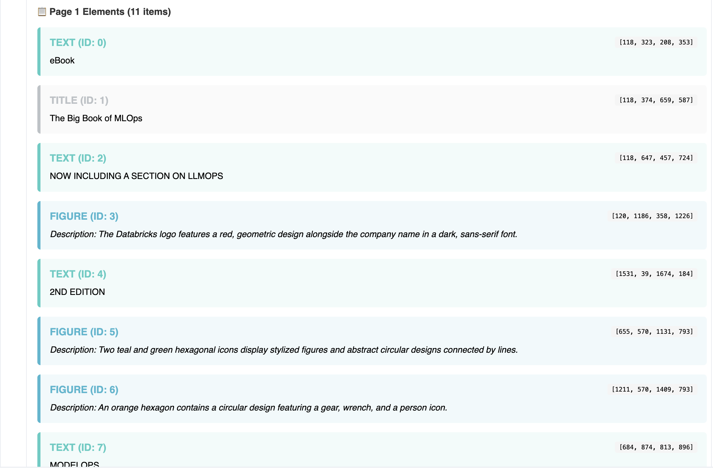
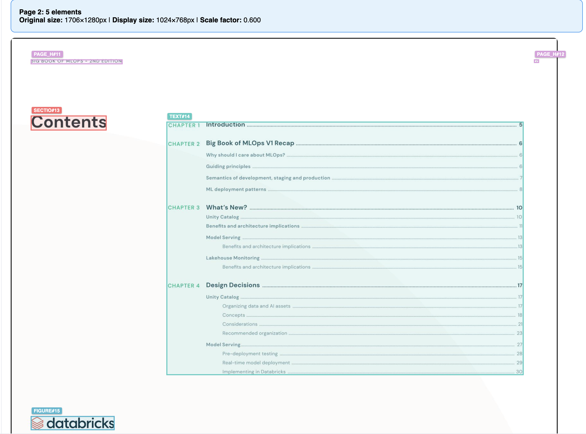
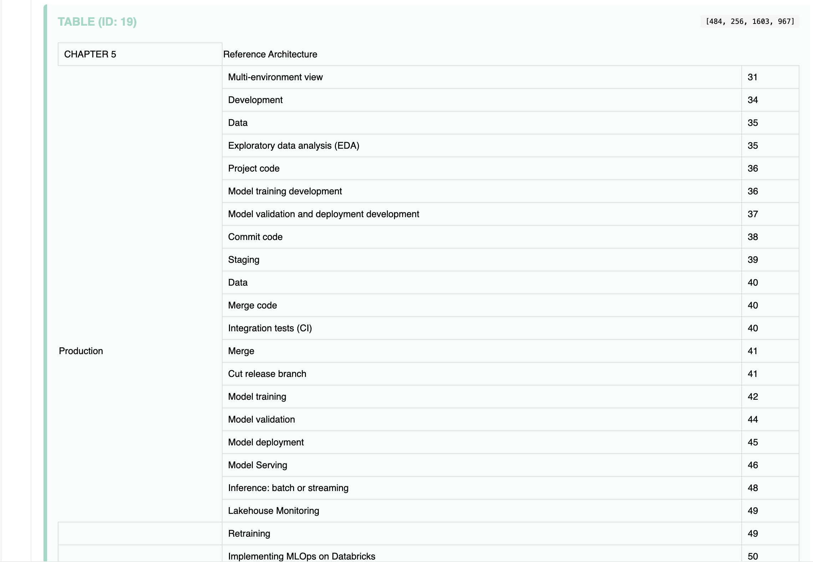
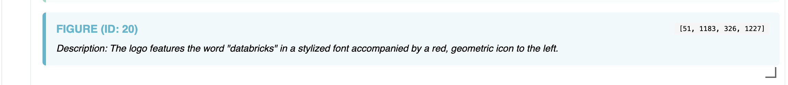

# AI Document Processing Job with Structured Streaming

A Databricks Asset Bundle demonstrating **incremental document processing** using `ai_parse_document`, `ai_query`, and Databricks Jobs with Structured Streaming.

## Overview

This example shows how to build an incremental job that:
1. **Parses** PDFs and images using [`ai_parse_document`](https://docs.databricks.com/aws/en/sql/language-manual/functions/ai_parse_document)
2. **Extracts** clean text with incremental processing
3. **Analyzes** content using [`ai_query`](https://docs.databricks.com/aws/en/sql/language-manual/functions/ai_query) with LLMs

All stages run as Python notebook tasks in a Databricks Job using Structured Streaming with serverless compute.

## Architecture

```
Source Documents (UC Volume)
         ↓
    Task 1: ai_parse_document → parsed_documents_raw (variant)
         ↓
    Task 2: text extraction   → parsed_documents_text (string)
         ↓
    Task 3: ai_query          → parsed_documents_structured (json)
```

### Key Features

- **Incremental processing**: Only new files are processed using Structured Streaming checkpoints
- **Serverless compute**: Runs on serverless compute for cost efficiency
- **Task dependencies**: Sequential execution with automatic dependency management
- **Parameterized**: Catalog, schema, volumes, and table names configurable via variables
- **Error handling**: Gracefully handles parsing failures
- **Visual debugging**: Interactive notebook for inspecting results

## Prerequisites

- Databricks workspace with Unity Catalog
- Databricks CLI v0.218.0+
- Unity Catalog volumes for:
  - Source documents (PDFs/images)
  - Parsed output images
  - Streaming checkpoints
- AI functions (`ai_parse_document`, `ai_query`)

## Quick Start

1. **Install and authenticate**
   ```bash
   databricks auth login --host https://your-workspace.cloud.databricks.com
   ```

2. **Configure** `databricks.yml` with your workspace settings

3. **Validate** the bundle configuration
   ```bash
   databricks bundle validate
   ```

4. **Deploy**
   ```bash
   databricks bundle deploy
   ```

5. **Upload documents** to your source volume

6. **Run job** from the Databricks UI (Workflows)

## Configuration

Edit `databricks.yml`:

```yaml
variables:
  catalog: main                                                    # Your catalog
  schema: default                                                  # Your schema
  source_volume_path: /Volumes/main/default/source_documents      # Source PDFs
  output_volume_path: /Volumes/main/default/parsed_output         # Parsed images
  checkpoint_base_path: /Volumes/main/default/checkpoints         # Checkpoints
  raw_table_name: parsed_documents_raw                            # Table names
  text_table_name: parsed_documents_text
  structured_table_name: parsed_documents_structured
```

## Job Tasks

### Task 1: Document Parsing
**File**: `src/transformations/01_parse_documents.py`

Uses `ai_parse_document` to extract text, tables, and metadata from PDFs/images:
- Reads files from volume using Structured Streaming
- Stores variant output with bounding boxes
- Incremental: checkpointed streaming prevents reprocessing

### Task 2: Text Extraction
**File**: `src/transformations/02_extract_text.py`

Extracts clean concatenated text using `transform()`:
- Reads from previous task's table via streaming
- Handles both parser v1.0 and v2.0 formats
- Uses `transform()` for efficient text extraction
- Includes error handling for failed parses

### Task 3: AI Query Extraction
**File**: `src/transformations/03_extract_structured_data.py`

Applies LLM to extract structured insights:
- Reads from text table via streaming
- Uses `ai_query` with Claude Sonnet 4
- Customizable prompt for domain-specific extraction
- Outputs structured JSON

## Visual Debugger

The included notebook visualizes parsing results with interactive bounding boxes.

**Open**: `src/explorations/ai_parse_document -- debug output.py`

**Configure widgets**:
- `input_file`: `/Volumes/main/default/source_docs/sample.pdf`
- `image_output_path`: `/Volumes/main/default/parsed_out/`
- `page_selection`: `all` (or `1-3`, `1,5,10`)

**Features**:
- Color-coded bounding boxes by element type
- Hover tooltips showing extracted content
- Automatic image scaling
- Page selection support

### Example Output

**Document Summary with Element Types**



**Visual Bounding Boxes on Page 1**



**Extracted Elements with Descriptions**



**Page 2 Contents Table with Bounding Boxes**



**Table Extraction Example**



**Figure Description**



## Project Structure

```
.
├── databricks.yml                      # Bundle configuration
├── resources/
│   └── ai_parse_document_job.job.yml
├── src/
│   ├── transformations/
│   │   ├── 01_parse_documents.py
│   │   ├── 02_extract_text.py
│   │   └── 03_extract_structured_data.py
│   └── explorations/
│       └── ai_parse_document -- debug output.py
└── README.md
```

## Resources

- [Databricks Asset Bundles](https://docs.databricks.com/dev-tools/bundles/)
- [Databricks Workflows](https://docs.databricks.com/workflows/)
- [Structured Streaming](https://docs.databricks.com/structured-streaming/)
- [`ai_parse_document` Function](https://docs.databricks.com/aws/en/sql/language-manual/functions/ai_parse_document)
- [`ai_query` Function](https://docs.databricks.com/aws/en/sql/language-manual/functions/ai_query)
